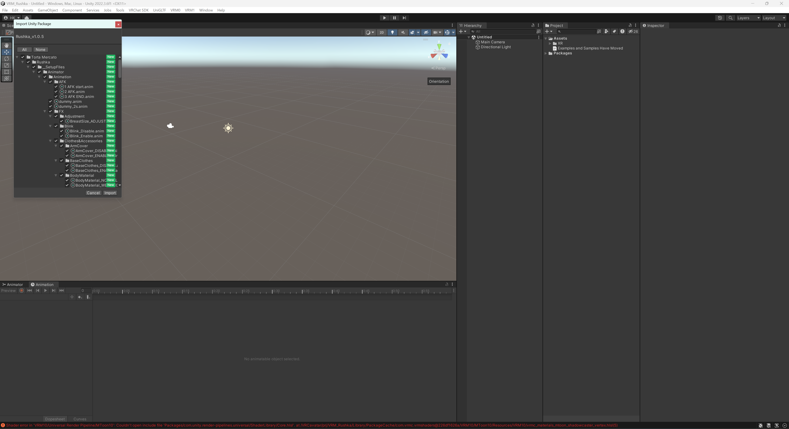
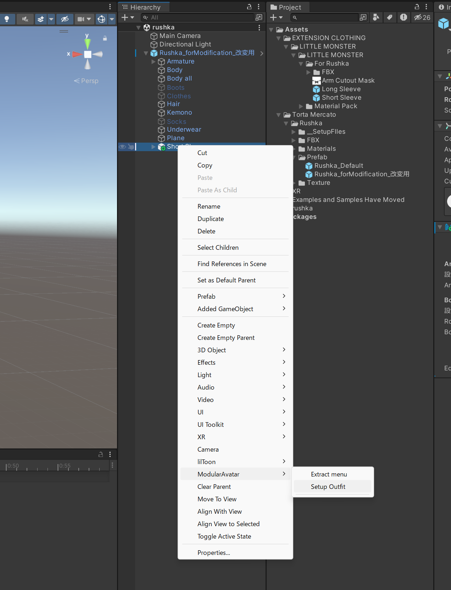
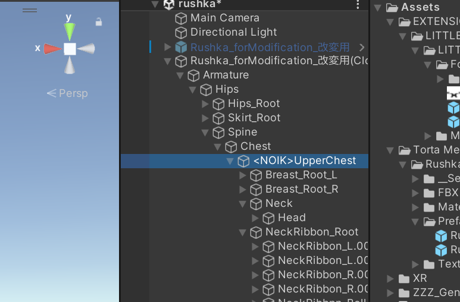
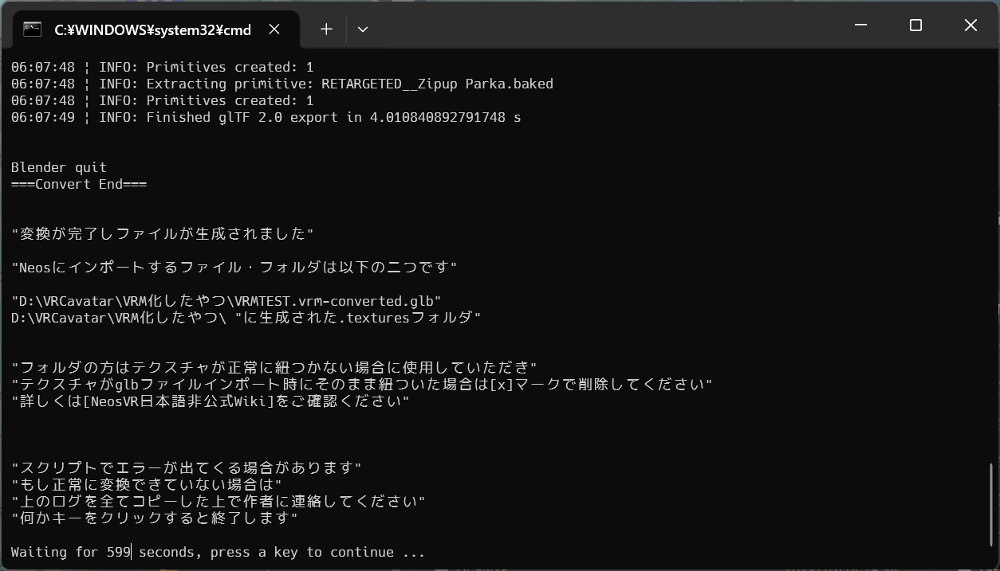

Modular Avatarをつかって着せ替えしたVRChatアバターをVRM化してResoniteに持ち込む方法の1つ

手順の概略
- [Modular Avatar](https://modular-avatar.nadena.dev/ja/docs/intro)を使いアバターの着せ替えをしてVRChatにアップロード
- シェイプキーをすべて0にしておく（そうするとResoniteにインポートした際、シェイプキーの欠落・異常がなくなるかも？）
- VRMに変換する
- VRMファイルの動作確認のためclusterにアップロード
- VRM最新版に変換する
- GLBに変換後、Resoniteにインポート

これを書いたときの環境など
- 使用アバター  [ルーシュカ](https://booth.pm/ja/items/4296675)（[とるた めるか～と -Torta Mercato-](https://tortamercato.booth.pm/)）
- 使用衣装  [満月少女](https://booth.pm/ja/items/4998054)（[ʚ♡ɞ__xIIIange__ʚ♡ɞ](https://xiiiange.booth.pm/)）
- Win11 Pro 22H1 build 22621.2428 / Unity 2019.4.31f1 / VRCSDK **3.4.2**

実際の手順

➀ [VCC](https://vrchat.com/home/download) でアバターのプロジェクト作成
- Modular Avatar,liltoon(アバター・衣装が他のシェーダーを指定している場合はそれに従う)を追加して作成
- UniVRM-0.99は別途ダウンロードして追加

② アバター、衣装のunitypackageインポート

③アバター、衣装のprefabをhierarchyに入れる

④ hierarchyの衣装のルートを選択して右クリックして、Modular Avatar > Setup Outfitを選択

⑤ メニューバーのVRChat SDK > Show Control Panelを選択して、Build&Publish する(VRChatにアップロードしない人はこの手順は省略してよい)

⑥ hierarchyのアバタールートを選択して、メニューバーのTools > Modular Avatar > Manual bake avatar を選択
- アバター名(clone)がhierarchyに追加される
- シェイプキーをすべて0にしておく（そうするとResoniteにインポートした際、シェイプキーの欠落・異常がなくなるかも？）
 - シェイプキーの変更はResonite内でもできるので、ここでは0にしておく
   
⑦ hierarchyのアバター名(clone)を選択して、メニューバーのVRM0 > Export to VRM0.xを選択
表示されたダイアログにライセンス情報を適切に入力してExportを押す

⑧ VRMファイルが出力される。
- この時点で、[VRM Live Viwer](https://booth.pm/ja/items/1783082)などを使い表示に異常がないか確認しおく
- clusterなどのVRMに対応したプラットフォームにアップロードして確認してもよいが、各プラットフォームの制約でアップロードできない場合がある

⑨VRM最新版に更新する

- Unity 2021.3 LTS以降で新規プロジェクト(3D)を作る

- VRMShaders、VRMShaders、UniVRM、VRMのパッケージを追加
  - VRMShaders com.vrmc.vrmshader: https://openupm.com/packages/com.vrmc.vrmshaders/#modal-manualinstallation
  - GLTF com.vrmc.gltf: https://openupm.com/packages/com.vrmc.gltf/#modal-manualinstallation
  - UniVRM com.vrmc.univrm(VRM0): https://openupm.com/packages/com.vrmc.univrm/#modal-manualinstallation
  - VRM com.vrmc.vrm(VRM1.0): https://openupm.com/packages/com.vrmc.vrm/#modal-manualinstallation
  
- Projectに手順⑦⑧でエクスポートしたVRMファイルをドラッグ＆ドロップする。自動で変換されPrefabが生成される。

- 生成されたPrefabをヒエラルキーにドラッグ＆ドロップする。

- アバターのアーマチュアを展開してリグとして認識させないボーンの名前の先頭に&lt;NOIK&gt;と追加する
  - ルーシュカのUpperChest
  - 満月少女のSpine ribbon*
  - leg accessory*も&lt;NOIK&gt;にすべきだと思うが後述の理由によりとりあえず無視

⑩ ヒエラルキーでアバタールートを選択して VRM0 → Export to VRM0.xをクリック
- ライセンス等を適切に記述
- ExportSettingタブでDivide Vertex Bufferにチェックを入れる
- ExportをクリックしてExport実行（今回は New_mangetsuBlue.vrm というファイル名でエクスポート）

⑪ 変換スクリプトを使う
- 「[VRMをNeos対応っぽく自動で変換できるやつ](https://booth.pm/ja/items/4104649)」を使い変換する
  - 最新版の変換スクリプトを使いたい場合は、githubにある [vrmtoglb_autoconvert](https://github.com/kazu0617/vrmtoglb_autoconvert) をよく読んでダウンロード
  - [VRMをNeos対応っぽく自動で変換できるやつ](https://booth.pm/ja/items/4104649) は実行中に blender を使う。（ユーザーは blender を操作する必要はない）
  - blender がインストールされていない場合は自動的に最新のblenderをダウンロードしてインストールされる。

- 変換方法
手順⑩でエクスポートしたVRMファイル（New_mangetsuBlue.vrm）を_convert.batにドラッグ＆ドロップすると自動的に変換される

- 変換が進んでいき・・・・

- こうなれば変換は成功

⑫ VRMファイル名＋converted.glbというファイルが出力されているので、これをResoniteにインポート（Resoniteのウィンドウにドラッグ＆ドロップ）する。
モデルインポーターのダイアログが表示されるので、3Dモデル → 一般的なほとんどのモデル → ヒューマノイドの身長に自動設定 → 高度な設定
- マテリアル　XiexeToon
- 「アセットをオブジェクト内に入れる」を☑
- インポート実行を押す

⑬ モデルが表示されれば完了

少し待てばテクスチャーも反映されるはずだが数分待っても反映しない場合は、VRMファイル名＋converted.glbが出力されているフォルダにテクスチャーも出力されているので、ResoniteにインポートしてモデルのXiexetoonマテリアルに設定する（設定方法は省略）

⑫ アバタークリエイターでアバター化する（省略）

⑬ アバター作者・衣装作者が凄くがんばったマテリアルはResoniteに反映していないので、自分でなんとかするか有識者に聞く
今回使った衣装（満月少女）は、服の色を色調補正で表現しているので、あらかじめマテリアルのメインカラーで焼き込み（liltoonの機能）を行っておくと良い（下図参照）

 - leg accessory*に&lt;NOIK&gt;を追記しなかったわけ
   右足のえっちひもが何をどうやってもメッシュが変形する対処としてResonite内では非表示としているため（なにかに引っ張られるような変形のしかたなので、&lt;NOIK&gt;を付けるべき箇所が他にもあるかも知れない？）

参考にした情報源
- [VRMアバターについて](https://sharedx.notion.site/VRM-d93c6e3ae2f647e0956054efff1d20b9)
- [Avatar_Import#ボーン、ブレンドシェイプ名の注意点など](https://neosvrjp.memo.wiki/d/Avatar_Import#content_1)
- [VRChat向けfbxモデル「薄荷」をResoniteに導入する方法(glb変換) ](https://note.com/ckkcobalt/n/n9db7c3e8a1f5)
