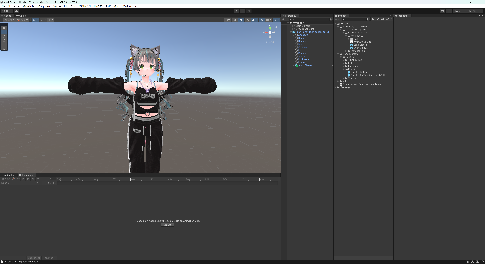
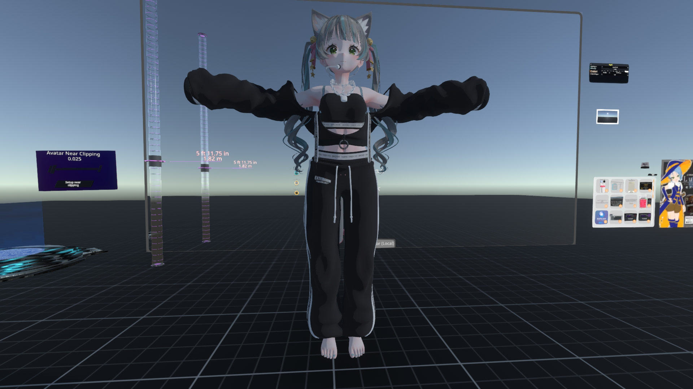

# Modular Avatarをつかって着せ替えしたVRChatアバターをVRM化してResoniteに持ち込む方法の1つ(Unity 2022.3.6.f1 / VRCSDK 3.5.0)
 - この文書は Unity 2022.3.6.f1 / VRCSDK **3.5.0** / UniVRM-v0.118.0 を対象としている
 - Unity 2019.4.31f1 / VRCSDK 3.4.2 / UniVRM-0.99 を対象とした文書は[こちら](https://github.com/konto250/VRMimport/tree/for2019)

## 手順の概略
- [Modular Avatar](https://modular-avatar.nadena.dev/ja/docs/intro)を使いアバターの着せ替えをしてVRChatにアップロード
- シェイプキーをすべて0にしておく（そうするとResoniteにインポートした際、シェイプキーの欠落・異常がなくなるかも？）
- UniVRM 最新版を使いVRM形式でエクスポートする
- GLBに変換後、Resoniteにインポート

## これを書いたときの環境など
- 使用アバター  [ルーシュカ](https://booth.pm/ja/items/4296675)（[とるた めるか～と -Torta Mercato-](https://tortamercato.booth.pm/)）
- 使用衣装  [EXTENSION CLOTHING『LITTLE MONSTER』](https://extension.booth.pm/items/4604087)（[EXTENSION CLOTHING](https://extension.booth.pm/)）
- Win11 Pro 23H2 build 22631.3085 / Unity 2022.3.6.f1 / VRCSDK **3.5.0** / UniVRM-v0.118.0

## 実際の手順

### ➀ [VCC](https://vrchat.com/home/download) でアバターのプロジェクト作成
- Modular Avatar,liltoon(アバター・衣装が他のシェーダーを指定している場合はそれに従う)を追加して作成
- UniVRM 最新版のパッケージを追加
  - githubのvrm-c/UniVRMを参照(https://github.com/vrm-c/UniVRM/releases)

### ② アバター、衣装のunitypackageインポート

### ③アバター、衣装のprefabをhierarchyに入れる

### ④ hierarchyの衣装のルートを選択して右クリックして、Modular Avatar > Setup Outfitを選択

### ⑤ メニューバーのVRChat SDK > Show Control Panelを選択して、Build&Publish する(VRChatにアップロードしない人はこの手順は省略してよい)

### ⑥ hierarchyのアバタールートを選択して、メニューバーのTools > Modular Avatar > Manual bake avatar を選択
- アバター名(clone)がhierarchyに追加される
- シェイプキーの変更はResonite内でもできるので、ここではシェイプキーをすべて0にしておく（そうするとResoniteにインポートした際、シェイプキーの欠落・異常がなくなるかも？）
- アバターのアーマチュアを展開してリグとして認識させないボーンの名前の先頭に&lt;NOIK&gt;と追記する。ルーシュカの場合はUpperChest。
- 衣装にも&lt;NOIK&gt;の追記が必要となる場合もある

### ⑦ hierarchyのアバター名(clone)を選択して、メニューバーのVRM0 > Export to VRM0.xを選択
- 表示されたダイアログにライセンス情報を適切に入力してExportを押す
- ExportSettingタブでDivide Vertex Bufferにチェックを入れる
- ExportをクリックしてExport実行（今回は VRMTEST.vrm というファイル名でエクスポート）

### ⑧ VRMファイルが出力される。
- この時点で、[VRM Live Viwer](https://booth.pm/ja/items/1783082)などを使い表示に異常がないか確認しおく
- clusterなどのVRMに対応したプラットフォームにアップロードして確認してもよいが、各プラットフォームの制約でアップロードできない場合がある

### ⑨ 変換スクリプトを使う
- 「[VRMをNeos対応っぽく自動で変換できるやつ](https://booth.pm/ja/items/4104649)」を使い変換する
  - 最新版の変換スクリプトを使いたい場合は、githubにある [vrmtoglb_autoconvert](https://github.com/kazu0617/vrmtoglb_autoconvert) をよく読んでダウンロード
  - [VRMをNeos対応っぽく自動で変換できるやつ](https://booth.pm/ja/items/4104649) は実行中に blender を使う。（ユーザーは blender を操作する必要はない）
  - blender がインストールされていない場合は自動的に最新のblenderをダウンロードしてインストールされる。

- 変換方法
手順⑧でエクスポートしたVRMファイル（VRMTEST.vrm）を_convert.batにドラッグ＆ドロップすると自動的に変換される

- 変換が進んでいき・・・・

- こうなれば変換は成功

### ⑩ VRMファイル名＋converted.glbというファイルが出力されているので、これをResoniteにインポート（Resoniteのウィンドウにドラッグ＆ドロップ）する。
モデルインポーターのダイアログが表示されるので、3Dモデル → 一般的なほとんどのモデル → ヒューマノイドの身長に自動設定 → 高度な設定
- マテリアル　XiexeToon
- 「アセットをオブジェクト内に入れる」を☑
- インポート実行を押す

### ⑪ モデルが表示されれば完了

少し待てばテクスチャーも反映されるはずだが数分待っても反映しない場合は、VRMファイル名＋converted.glbが出力されているフォルダにテクスチャーも出力されているので、ResoniteにインポートしてモデルのXiexetoonマテリアルに設定する（設定方法は省略）

### ⑫ アバタークリエイターでアバター化する（省略）
 - 揺れ物の設定
 - Shadowrampの調整
 - Eye ManagerのMaxSwingの調整
 - etc, etc...

### ⑬ アバター作者・衣装作者が凄くがんばったマテリアルはResoniteに反映していないので、自分でなんとかするか有識者に聞く
liltoonの色調補正の焼き込み、アルファの焼き込みだけでなんとかなることもある

### ⑭ その他
UniVRMの最新版が使えるのであれば、VRM形式を経由せずともUniGLTFで直接gltfで出力してResoniteにインポートすることも可能だと思う（試してない）

## 参考にした情報源
- [VRMアバターについて](https://sharedx.notion.site/VRM-d93c6e3ae2f647e0956054efff1d20b9)
- [Avatar_Import#ボーン、ブレンドシェイプ名の注意点など](https://neosvrjp.memo.wiki/d/Avatar_Import#content_1)
- [VRChat向けfbxモデル「薄荷」をResoniteに導入する方法(glb変換) ](https://note.com/ckkcobalt/n/n9db7c3e8a1f5)
