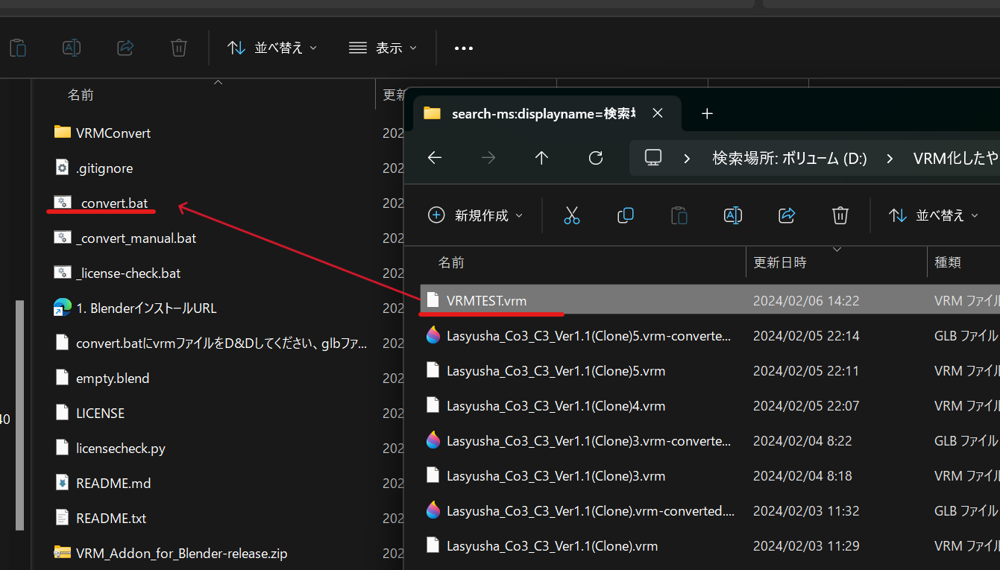
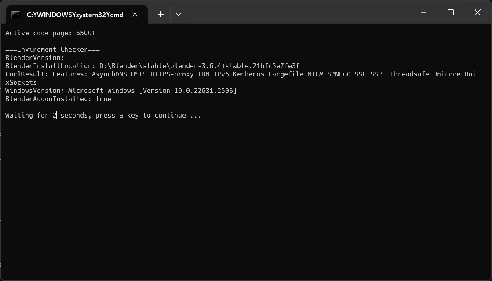
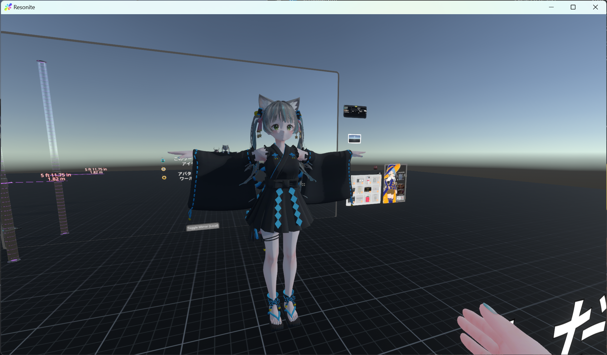

Resonite VRMインポート

2023年10月17日 8:20

前提条件
    使用アバター [ポンデロニウム研究所](https://ponderogen.booth.pm/) [桔梗](https://booth.pm/ja/items/3681787)

    使用衣装 [EXTENSION CLOTHING](https://extension.booth.pm/) [DROP DEAD](https://booth.pm/ja/items/4689830)

    Win11 Pro 22H1 build 22621.2428

    Blender 3.6.4

    Unity 2019.4.31f1

➀ VCCでアバターのプロジェクト作成
　Modular Avatar,liltoon(アバター・衣装が他のシェーダーを指定している場合はそれに従う)を追加して作成
　UniVRM-0.99は別途ダウンロードして追加

② アバター、衣装のunitypackageインポート

③アバター、衣装のprefabをhierarchyに入れる

④ hierarchyの衣装のルートを選択して右クリックして、Modular Avatar > Setup Outfitを選択

⑤ メニューバーのVRChat SDK > Show Control Panelを選択して、Build&Pulish する(VRChatにアップロードしない人はこの手順は省略してよい)

⑥ hierarchyのアバタールートを選択して、メニューバーのTools > Modular Avatar > Manual bake avatar を選択
    アバター名(clone)がhierarchyに追加される

⑦ hierarchyのアバター名(clone)を選択して、メニューバーのVRM0 > Export to VRM0.xを選択
表示されたダイアログにライセンス情報を適切に入力してExportを押す

⑧ VRMファイルが出力される。

⑨＜追記＞ VRM最新版

⑩ 「[VRMをNeos対応っぽく自動で変換できるやつ](https://booth.pm/ja/items/4104649)」を使い変換する
最新版を使いたい場合は、githubにある [vrmtoglb_autoconvert](https://github.com/kazu0617/vrmtoglb_autoconvert) からダウンロード

[VRMをNeos対応っぽく自動で変換できるやつ](https://booth.pm/ja/items/4104649) は実行中に blender を使う。（ユーザーは blender を操作する必要はない）
blender がインストールされていない場合は自動的に最新のblenderをダウンロードしてインストールされる。

変換方法
VRMファイルを_convert.batにドラッグ＆ドロップすると自動的に行われる

変換が進んでいき・・・・

こうなったら変換は成功

⑩ VRMファイル名＋converted.glbというファイルが出力されているので、これをResoniteにインポート（Resoniteのウィンドウにドラッグ＆ドロップ）する。
モデルインポーターのダイアログが表示されるので、3Dモデル → 一般的なほとんどのモデル → ヒューマノイドの身長に自動設定 → 高度な設定
    マテリアル　XiexeToon
    「アセットをオブジェクト内に入れる」を☑
    インポート実行を押す

⑪ モデルが表示されれば完了

少し待てばテクスチャーも反映されるはずだが数分待っても反映しない場合は、VRMファイル名＋converted.glbが出力されているフォルダにテクスチャーも出力されているので、ResoniteにインポートしてモデルのXiexetoonマテリアルに設定する（設定方法は省略）

⑫ アバタークリエイターでアバター化する（省略）

⑬ 衣装作者が凄くがんばったマテリアルはResoniteに反映していない（VRMにする時点で欠落している）ので、自分でなんとかするか有識者に聞く
